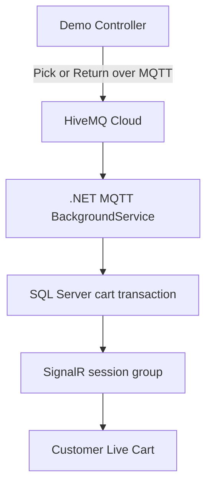

# Grab&Go Frontend

> A Vanilla JavaScript demonstration frontend for an event-driven cashierless-retail backend.

Grab&Go Frontend visualizes the complete customer, gate, and simulated vision-system journey for the [Grab&Go ASP.NET Core backend](https://github.com/AhmadEdais/GrabAndGo).

The repository contains three browser-based actors:

- a responsive customer application
- a gate and QR simulator
- a demo controller that publishes the events expected from a production computer-vision system

The frontend is intentionally more than a set of customer screens. It is a demonstration and integration environment for validating REST APIs, SignalR notifications, MQTT event ingestion, shopping-session state, and checkout behavior across system boundaries.

## Project Status and Scope

This is a working engineering prototype, not a production cashierless-store product.

Implemented and demonstrated here:

- customer registration and JWT-based login
- wallet balance and demo top-up
- HMAC-authenticated, expiring, single-use gate QR flow
- shopping-session creation
- waiting-for-entry-tracking state
- simulated Track ID association
- simulated Pick and Return event publication over MQTT
- session-scoped live-cart updates over SignalR
- exit and checkout simulation
- invoice display, PDF-ready notification, and PDF download
- purchase-history and profile screens

Conceptual or simulated:

- production computer-vision inference
- real person tracking
- physical entry and exit gates
- shelf cameras and edge devices
- production device provisioning

The Demo Controller simulates the messages and hardware actions that those production components would generate. It does **not** update the customer cart directly.

## Why This Frontend Exists

A normal UI recording can make the project appear to be a button changing another screen. The actual path is distributed:



This repository makes each boundary visible and testable while preserving the contract expected from future cameras and edge devices.

## Demonstration Actors

| Actor | Entry page | Responsibility |
|---|---|---|
| Customer application | `index.html` | Authentication, QR scanning, entry state, live cart, wallet, invoices, and receipts |
| Gate simulator | `gate.html` | Generates a store-entry QR and refreshes it after use |
| Demo controller | `demo-controller.html` | Simulates Track ID binding, Pick/Return events, and exit checkout |

### Customer application

The customer-facing flow is responsive and designed to resemble a mobile shopping application. It uses REST for commands and initial state, then SignalR for server-pushed updates.

### Gate simulator

The gate page represents store hardware. It requests a short-lived QR token using the gate API key and joins a store-specific SignalR group. After a token is consumed, the backend asks the gate page to generate a replacement.

### Demo controller

The demo controller represents the unavailable production vision and tracking system. It:

1. receives newly entered sessions through SignalR
2. generates and binds a simulated Track ID
3. publishes Pick and Return messages over MQTT
4. sends a simulated exit event to the checkout endpoint

The Pick and Return buttons publish MQTT messages only. Cart state is changed by the backend worker and SQL Server, then delivered independently to the customer through SignalR.

## End-to-End Flow

### 1. Authentication

The customer registers or signs in. The backend returns a JWT, which the prototype stores in browser local storage and attaches to authenticated REST and SignalR requests.

### 2. Gate entry

1. `gate.html` requests a gate QR for store `1`.
2. The customer opens `scan.html` and grants camera access.
3. `jsQR` decodes the QR in the browser.
4. The customer is redirected to `entering-store.html` with the gate token.
5. The backend verifies the HMAC-authenticated token, expiration, and single-use state.
6. SQL Server atomically consumes the token and creates a Session and Cart.
7. The customer remains on the entering-store screen until tracking is associated.

### 3. Track association

1. The backend broadcasts `SessionEntered` to the demo feed.
2. The controller displays the incoming session.
3. Pressing **Bind** generates a simulated Track ID and calls the hardware-oriented bind endpoint.
4. The backend broadcasts `TrackBound` to the customer's session group.
5. The customer automatically enters `live-cart.html`.

In production, an entry camera and tracking service would supply the Track ID. This repository simulates that integration boundary.

### 4. Pick and Return

The controller publishes an MQTT payload like this:

```json
{
  "TrackId": "C_demo_014",
  "AiLabel": "teeba_water",
  "Action": "Pick",
  "EventTime": "2026-08-01T12:00:00.000Z",
  "Confidence": 0.97,
  "CameraCode": "CAM_DEMO"
}
```

The backend MQTT worker consumes the event, resolves the active Track ID binding, maps the AI label to a product, persists the cart change, and broadcasts `ReceiveCartUpdate` to the correct SignalR session group.

The customer frontend does not poll for cart changes.

### 5. Checkout and invoice

1. The demo controller sends the customer's Track ID to the gate checkout endpoint.
2. The backend calculates the cart total and performs the wallet, transaction, session, and invoice-stub changes transactionally in SQL Server.
3. The customer receives `GateStatusUpdate` through SignalR.
4. A successful checkout redirects the customer to the invoice page.
5. The backend invoice worker generates the PDF asynchronously.
6. The invoice page receives `InvoicePdfReady`, refreshes its state, and enables PDF viewing.

## Frontend Architecture

This is a framework-free frontend. Each HTML page has a matching JavaScript module, while shared behavior is kept in `shared/`.

```text
GrabAndGo_Frontend/
 index.html / index.js                 # Landing and auth routing
 register.html / register.js           # Customer registration
 login.html / login.js                 # Customer login
 home.html / home.js                   # Customer home
 scan.html / scan.js                   # Camera-based gate QR scanner
 entering-store.html / .js             # Session created; waiting for Track ID
 live-cart.html / live-cart.js          # SignalR-driven live cart
 profile.html / profile.js              # Wallet and account view
 receipts.html / receipts.js            # Purchase history
 invoice.html / invoice.js              # Invoice and PDF-ready updates
 gate.html / gate.js                    # Physical-gate simulator
 demo-controller.html / .js             # Vision and exit simulator
 store-detail.html / .js                # Alternative local test flow
 shared/
‚    api.js                             # REST client functions
‚    config.js                          # Environment-specific demo config
‚    guard.js                           # Auth-route guard
‚    nav.js                             # Shared customer navigation
‚    styles.css                         # Shared design system
‚    lib/jsQR.min.js                    # Vendored QR decoder
 NOTICE.txt                             # jsQR attribution
```

## Technology

| Area | Technology |
|---|---|
| UI | HTML5 and CSS3 |
| Application code | Vanilla JavaScript |
| REST communication | Browser Fetch API |
| Customer real-time updates | ASP.NET Core SignalR client |
| Device-event publishing | MQTT.js over secure WebSockets |
| QR decoding | jsQR |
| QR rendering in the current demo | goQR API |
| Authentication | JWT Bearer token supplied by the backend |
| Local persistence | Browser `localStorage` |

No Node.js build step is required.

## Backend Integration

Related backend repository:

- [AhmadEdais/GrabAndGo](https://github.com/AhmadEdais/GrabAndGo)

The frontend expects these backend channels:

| Channel | Purpose |
|---|---|
| `/api` | REST commands and queries |
| `/hubs/cart` | Session entry, Track ID, cart, and checkout events |
| `/hubs/gate` | Gate QR refresh events |
| `/hubs/invoice` | Asynchronous invoice PDF notification |
| HiveMQ WebSocket endpoint | Demo Pick and Return publication |

Representative SignalR events:

| Event | Consumer |
|---|---|
| `SessionEntered` | Demo controller |
| `TrackBound` | Entering-store page |
| `ReceiveCartUpdate` | Live-cart page |
| `GateStatusUpdate` | Live-cart page |
| `RefreshQrToken` | Gate simulator |
| `InvoicePdfReady` | Invoice page |


## Configuration and Security Boundaries

Browser JavaScript is public by design. Anything placed in `shared/config.js` can be read by a user and must not be treated as a production secret.

### Demo publisher credential

The MQTT username and password used by `demo-controller.html` belong to a deliberately limited demo publisher. The account should be:

- publish-only
- restricted to the exact demo topic
- unable to subscribe or administer the broker
- rate-limited where possible
- disposable and never reused elsewhere

This pattern is acceptable only for a controlled demonstration. A public production browser should publish through an authenticated backend or short-lived token exchange instead of containing a reusable broker credential.

### Hardware simulator keys

`GATE_API_KEY` and `Vision_API_KEY` represent keys that would normally live on gate hardware or trusted edge devices. Their presence in this browser repository is only for the gate and vision simulators.

Do not configure a public production backend with the same demo values.

### Backend-only secrets

The following must never be placed in this repository:

- SQL Server or Azure SQL connection strings
- JWT signing key
- QR HMAC key
- backend MQTT subscriber credentials
- production gate or vision-device keys

The backend should receive them from environment variables, .NET User Secrets, or a managed secret store.

## Ownership and Graduation-Project Context

Grab&Go began as a group graduation-project concept. This repository contains the frontend, simulators, and system demonstration implemented by **Ahmad Edais** to exercise the backend end to end.

The production vision/tracking module and a separate native mobile client are not part of this repository. The browser Demo Controller exists to simulate the vision-system contract without claiming that computer-vision inference is implemented.

## License and Third-Party Notice

No license has currently been declared for the original Grab&Go source code.

The vendored `jsQR` library is distributed under the Apache License 2.0. See `NOTICE.txt` for attribution.
